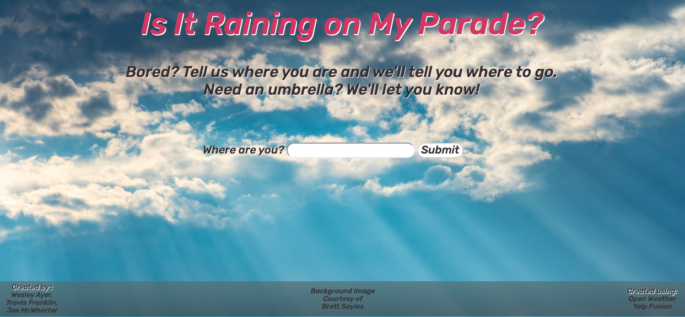
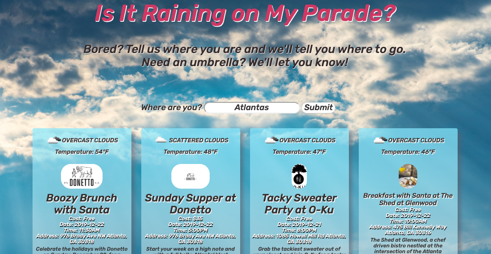

# Is it raining on my parade?

## Screenshots:

<<<<<<< HEAD
=======

>>>>>>> 643a7fdb22671e984033079686c35a166e2691c0

## What problem our app solves?

Our app combines data from two different sources, Yelp and Open Weather,in order to render a page that gives local event information combined with the local weather. Currently, the Yelp events page does not have weather information, which is relevant to the a user's decision to attend an event. Our app provides that information so visitors can make a more informed decision as to whether to attend a given event. 

## Description of how the app works.

Again, our app uses two different APIs to retrieve information. The Yelp API provides information about local events which we pull and combine with Open Weather information. 

The app first takes input from the user in the form of their current city location. Once the user inputs their city, the app pulls events for the next four days for that city from Yelp. From there, the city information is handed over to the Open Weather API and that weather information is pulled and combined with the results from Yelp.

The information that is retrieved is then populated to the app's webpage automatically using DOM elements. 

## A list of the APIs used:

https://openweathermap.org/api
https://www.yelp.com/fusion

## What features you would add next?

1.Allowing result cards to expand to provide more information once clicked. 
2.Integrating with other APIs in order to get more events. 

## Contributors include:
Wesley Ayer, Joe McWhorter, Travis Franklin